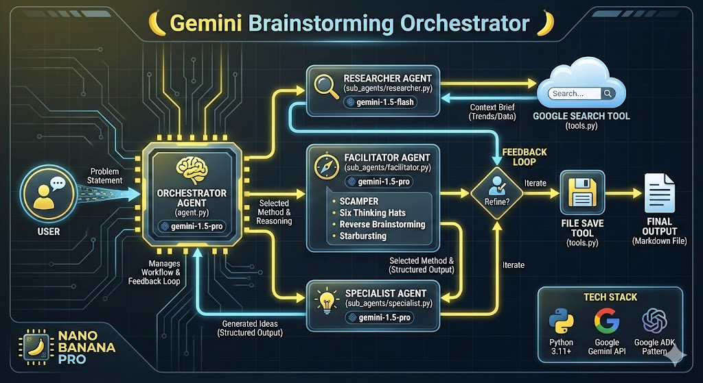

# Gemini Brainstorming Orchestrator



## Project Overview

### Problem Statement
Brainstorming sessions often suffer from a lack of structure, limited context, and "blank page" syndrome. Teams or individuals may struggle to choose the right framework for their problem, leading to unproductive sessions. Furthermore, ideas generated in isolation often lack grounding in real-world market trends or facts, resulting in concepts that are creative but not viable.

### Solution Statement
The **Gemini Brainstorming Orchestrator** is a Multi-Agent System that acts as an intelligent creative partner. Instead of just listing ideas, it actively researches the topic to understand the context, selects the most appropriate brainstorming framework (e.g., SCAMPER, Six Thinking Hats) based on the specific problem, and then generates structured, actionable ideas. This transforms brainstorming from a chaotic activity into a streamlined, data-driven process.

### Architecture
The system is built on a hierarchical multi-agent architecture using the **Google Agent Development Kit (ADK)** patterns.

-   **Orchestrator (`InteractiveBrainstormerAgent`)**: The central hub that manages the workflow, coordinates sub-agents, and interacts with the user.
-   **Sub-Agents**:
    -   **Researcher**: Uses `gemini-1.5-flash-002` to perform web searches and gather real-world context.
    -   **Facilitator**: Uses `gemini-1.5-pro-002` to analyze the problem and context, then selects the optimal brainstorming strategy.
    -   **Specialist**: Uses `gemini-1.5-pro-002` to execute the selected strategy and generate high-quality ideas.

## Essential Tools and Utilities

The agents are equipped with specialized tools to bridge the gap between AI reasoning and the real world:

-   **`web_search_tool`**: Allows the Researcher agent to query the web (via Google Search) to find current market trends, facts, and user pain points.
-   **`save_brainstorm_to_file`**: Enables the Orchestrator to save the final session output to a local Markdown file for future reference.

## Installation

1.  **Prerequisites**: Python 3.11+
2.  **Clone the repository**:
    ```bash
    git clone https://github.com/spartanglady/brainstorm_agent.git
    cd brainstorm_agent
    ```
3.  **Install Dependencies**:
    ```bash
    pip install -r requirements.txt
    ```
4.  **Configure Environment**:
    Create a `.env` file in the root directory and add your Google API Key:
    ```env
    GOOGLE_API_KEY=your_api_key_here
    ```

## Usage

Run the agent from the command line:

```bash
python -m brainstormer_agent.agent
```

Follow the interactive prompts to enter your problem statement. The agent will handle the rest, keeping you informed of its progress.

## Project Structure

```text
brainstormer_agent/          # Main Package
├── agent.py                 # The Main Orchestrator (Entry Point)
├── config.py                # Model configurations and API keys
├── tools.py                 # Custom tools (Search, File I/O)
└── sub_agents/              # Specialized Worker Agents
    ├── facilitator.py       # Decides the strategy (The Manager)
    ├── researcher.py        # Gathers context (The Analyst)
    └── specialist.py        # Generates ideas (The Creative)
tests/                       # Integration tests
```

## Workflow

1.  **Input**: User provides a problem statement (e.g., "How to sell more artisanal soap").
2.  **Research**: The **Researcher** agent analyzes the topic and performs a web search to gather context (trends, competitors, etc.).
3.  **Plan**: The **Facilitator** agent reviews the problem and the research context to select the best brainstorming method (e.g., SCAMPER vs. Six Hats).
4.  **Execute**: The **Specialist** agent generates ideas using the selected method and the gathered context.
5.  **Output**: The results are presented to the user, who can then choose to save them to a file.

## Value Statement
This tool reduces the cognitive load of setting up a brainstorming session and ensures that ideas are not just creative, but also relevant and grounded in reality. It acts as an on-demand innovation consultant, ready to help tackle any problem with structured creativity.
